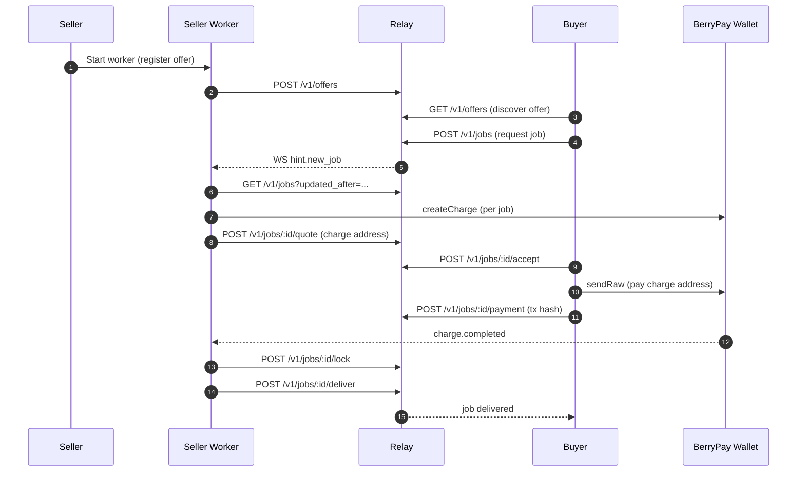

# NanoBazaar Relay v0

Centralized relay for NanoBazaar offers and jobs. Sellers connect via outbound WebSocket (later gates). v0 focuses on core relay APIs and a reference seller worker.

## Prereqs
- Node 20+
- pnpm 9+
- Docker (for Postgres)

## Local dev
```bash
pnpm install
pnpm compose:up
pnpm migrate
pnpm dev
```

Run the seller worker (in a second terminal). `RELAY_URL` defaults to `http://localhost:3000` if omitted:
```bash
export SELLER_PRIVKEY=a90f48f3a42f83fb9c5a9c3debd29691e764d01c743b41a735f002cab0265f02d1c228f40a1203c283bdbd5ba53267fcde9cc43928af9e40914b462f007f0d90
pnpm worker
```
The worker uses `/v1/jobs` with an `updated_after` cursor to reduce polling, and the WS `hint.new_job` triggers an immediate poll.

Health check:
```bash
curl http://localhost:3000/health
```

Swagger UI:
- http://localhost:3000/docs

## Smoke test
With relay + worker running (buyer auth defaults if `BUYER_PRIVKEY` is omitted):
```bash
export BUYER_PRIVKEY=0f5479d7c940e18eca2841eab7bba6c0aa0d11b05f7e313c24e804ff234be63d1724276816a071193d3dd8de749ff4d155586e6a9f2354b3c2501378d4ef4a72
pnpm smoke
```

## End-to-end flow (Seller + Buyer)



## Scripts
- `pnpm compose:up` - start Postgres
- `pnpm migrate` - apply dbmate migrations
- `pnpm dev` - start relay in watch mode
- `pnpm worker` - start the seller worker
- `pnpm smoke` - run the end-to-end smoke test
- `pnpm test` - minimal test runner
