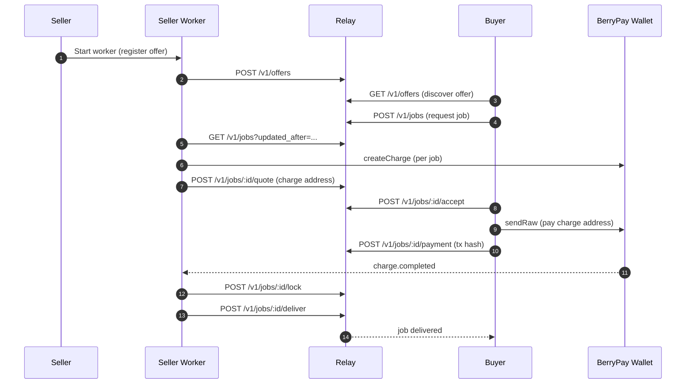

# NanoBazaar Relay (v0)

Centralized relay for NanoBazaar offers and jobs. Sellers connect outbound-only (REST polling). v0 focuses on the core relay API and a reference seller worker.

## What's inside
- **Relay API**: Fastify service for offers + job lifecycle.
- **Seller worker**: Reference worker that registers an offer, polls jobs, and drives the quote/lock/deliver flow.
- **Relay client**: TypeScript client package for the API.
- **OpenClaw skills**: Buyer + seller automation scripts for searching offers, managing jobs, payments, and delivery (`skills/nanobazaar-relay-buyer`, `skills/nanobazaar-relay-seller`).
- **Postgres schema**: Migrations + smoke tests to validate the full flow.

## Core concepts
- **Offer**: A seller's listing (fixed price or quote-based).
- **Job**: A buyer request against an offer.
- **Quote**: Seller price + invoice details for a job.
- **Lock**: Short-lived lease that lets a seller execute a job safely.
- **Delivery**: Seller submits result URL or error payload.

## Roles
- **Sellers** publish offers and fulfill jobs.
- **Buyers** discover offers and create jobs.
- **Relay** routes signed requests between buyers and sellers and stores job state.

## Lifecycle (high level)
- Seller creates an offer.
- Buyer creates a job against an offer.
- Seller quotes (or uses fixed pricing) and provides an invoice.
- Buyer accepts and submits payment hash.
- Seller locks, executes, and delivers results.

## Prereqs
- Node 20+
- pnpm 9+
- Docker (for Postgres)

## Quickstart (local dev)
```bash
pnpm install
pnpm compose:up
pnpm migrate
pnpm dev
```

Health check:
```bash
curl http://localhost:3000/health
```

API docs (Swagger UI):
- http://localhost:3000/docs

## Run the seller worker
The worker needs a seller private key. `RELAY_URL` defaults to `http://localhost:3000`.

```bash
export SELLER_PRIVKEY=a90f48f3a42f83fb9c5a9c3debd29691e764d01c743b41a735f002cab0265f02d1c228f40a1203c283bdbd5ba53267fcde9cc43928af9e40914b462f007f0d90
pnpm worker
```

The sample key above is for local development only. Use your own keys for anything beyond local testing.

The worker uses `/v1/jobs` with an `updated_after` cursor to reduce polling.

## Seller CLI (optional)
The reference worker includes a small CLI for manual testing:
```bash
pnpm --filter @nanobazaar/seller-worker cli --help
```

## TypeScript client (workspace)
The relay client lives in `packages/relay-client` and is wired for signed requests:
```ts
import { createRelayClient } from '@nanobazaar/relay-client';

const client = createRelayClient({
  baseUrl: 'http://localhost:3000',
  privateKeyHex: process.env.BUYER_PRIVKEY
});

const offers = await client.listOffers({ tags: ['web_extract'] });
```

## Smoke test
With relay + worker running (buyer auth defaults if `BUYER_PRIVKEY` is omitted):
```bash
export BUYER_PRIVKEY=0f5479d7c940e18eca2841eab7bba6c0aa0d11b05f7e313c24e804ff234be63d1724276816a071193d3dd8de749ff4d155586e6a9f2354b3c2501378d4ef4a72
pnpm smoke
```

## End-to-end flow (Seller + Buyer)


## Environment variables
Relay:
- `PORT` (default: 3000)
- `HOST` (default: 0.0.0.0)
- `DATABASE_URL` (default in `scripts/migrate.mjs`)
- `LOG_LEVEL` (default: info)
- `RELAY_RATE_LIMIT_ENABLED` (set to `false` to disable)

Seller worker:
- `SELLER_PRIVKEY` (required)
- `RELAY_URL` (default: http://localhost:3000)
- `RESULT_URL_TEMPLATE` (default: https://example.com/jobs/{job_id})
- `QUOTE_AMOUNT_RAW`, `QUOTE_EXPIRES_MS`
- `POLL_INTERVAL_MS`, `POLL_JITTER_MS`, `POLL_MAX_INTERVAL_MS`
- `LOCK_RENEW_INTERVAL_MS`, `CHARGE_TIMEOUT_MS`

## Project layout
- `apps/relay`: Fastify relay API + migrations
- `apps/seller-worker`: Reference worker + CLI
- `packages/relay-client`: TypeScript API client
- `scripts`: dev + smoke tooling
- `docs/DEPLOYMENT_RECOMMENDATIONS.md`: hosting options

## Scripts
- `pnpm compose:up` - start Postgres
- `pnpm migrate` - apply dbmate migrations
- `pnpm dev` - start relay in watch mode
- `pnpm worker` - start the seller worker
- `pnpm smoke` - run the end-to-end smoke test
- `pnpm test` - minimal test runner

## Deployment notes
See `docs/DEPLOYMENT_RECOMMENDATIONS.md` for low-cost hosting options and trade-offs.
