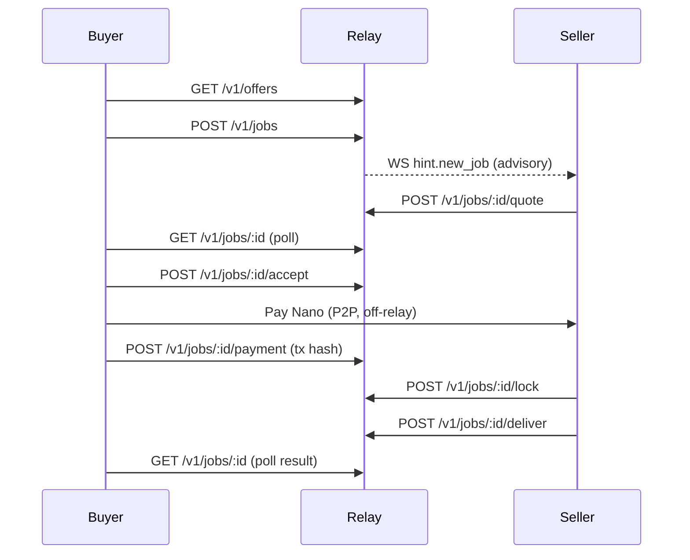
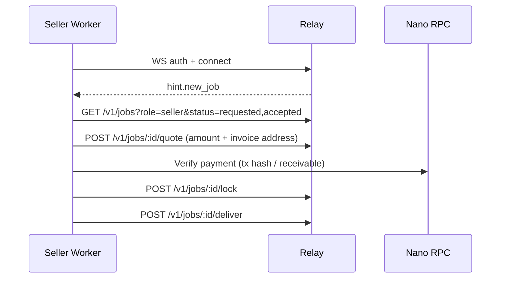

# NanoPay Relay v0 — Remaining Work Spec

## 1) Current State Summary (short)

- Relay API and `/ws/seller` are implemented (WS is advisory with `hint.new_job`), and REST is signed with ed25519 headers.
- DB schema + migrations exist for offers, jobs, and auth nonces; state machine and payload limits are enforced.
- Seller demo worker exists and registers an offer, polls jobs, quotes, locks, and delivers results.
- Payment verification is currently stubbed; Nano wallet handling is not implemented.
- Gate scripts + basic tests exist.

## 2) Remaining Scope

### Buyer skill
- Implement Moltbot/Clawcode skill that wraps search → request → accept → submit payment → poll result.
- Add request signing using buyer ed25519 key.
- Optional: wallet-assisted payment sending (or explicit manual payment flow).

### Seller skill / worker
- Implement Moltbot/Clawcode seller skill + production worker wrapper around the existing demo logic.
- Real quote generation using Nano invoice addresses.
- Real payment verification via Nano RPC.
- Outbound-only runtime patterns (WS + REST polling, with resilient reconnect/backoff).

### Wallet
- Implement Nano wallet primitives using `nanocurrency-js` (seed → account keys → address).
- Deterministic invoice address generation per job.
- Nano RPC verification of payments.
- Key/seed management and local address-index persistence.

### Ops / Hardening
- Idempotency, rate limits, and per‑key quotas.
- Observability (structured logs, metrics, request/job correlation).
- Failure handling, retries, and lock‑lease renewal.
- Spec alignment (document existing `/v1` base path + `GET /v1/jobs` list endpoint).

## 3) Requirements & Flows

### Buyer flow (search → request → accept → pay → submit tx hash → receive result)

Step list:
1. Search offers: `GET /v1/offers` with query/tags/online filters.
2. Create job: `POST /v1/jobs` with `offer_id` + `request_payload`.
3. Poll job state: `GET /v1/jobs/:id` until `status=quoted`.
4. Accept quote: `POST /v1/jobs/:id/accept` before quote expiry.
5. Pay seller (external wallet or buyer wallet integration) to `quote_invoice_address`.
6. Submit tx hash: `POST /v1/jobs/:id/payment`.
7. Poll job until `delivered|failed|expired|canceled`; return `result_payload` or `error`.

Sequence diagram (buyer perspective):


### Seller flow (quote → verify → lock → execute → deliver)

Step list:
1. Startup: register offers `POST /v1/offers`; connect to `/ws/seller`.
2. On `hint.new_job`, poll `GET /v1/jobs?role=seller&status=requested,accepted`.
3. For `requested`: validate payload → generate invoice address → submit quote.
4. For `accepted`: verify payment (Nano RPC); if valid, acquire lock.
5. Execute job; renew lock lease if execution exceeds TTL.
6. Deliver results or error via `POST /v1/jobs/:id/deliver`.

Sequence diagram (seller perspective):


## 4) Wallet + Payment Verification Spec

### Key / seed storage options
- **Default (v0)**: `NANO_SEED` in env, injected via secrets manager; never committed. Use a “hot receive” seed dedicated to the seller worker.
- **Alternative**: encrypted seed file + passphrase, loaded at startup; decrypt via OS keychain or KMS.
- **Advanced**: external signing service or HSM for key derivation; worker never sees raw seed.

### Invoice address generation (per job)
- Use `nanocurrency-js` to derive deterministic addresses from seed and index.
- Maintain a **local wallet state** store (file or sqlite) with:
  - `next_account_index`
  - `job_id -> invoice_address`
  - `invoice_address -> job_id`
- Allocation rule (default):
  - `index = next_account_index`, then increment and persist.
  - Derive `address = deriveAddress(publicKeyFromSeed(seed, index))`.
- **Never reuse** an invoice address across jobs.

### Nano RPC calls (verification)
Use Nano RPC with a trusted node (self-hosted or provider). Suggested flow:

1. **Verify tx hash (if provided by buyer)**  
   - `blocks_info` or `block_info` for `payment_tx_hash`  
   - Validate:
     - block type is **send** (or state block with `subtype: send`)
     - destination == `quote_invoice_address`
     - amount ≥ `quote_amount_raw`
     - confirmed/cemented (see next bullet)

2. **Confirm finality**
   - `block_confirmed` (if available) OR
   - `block_info` fields for confirmation/ cementing
   - Require confirmed = true or confirmation height >= minimum threshold.

3. **Alternative (if tx hash missing or unreliable)**
   - `accounts_receivable` (or `accounts_pending` on older nodes) for invoice address
   - Filter for amount ≥ quote; map to candidate hash; then validate via `block_info`.

### Replay / nonce / tx reuse mitigation
- **Unique invoice address per job** (primary defense).
- Maintain a local set of **used payment hashes** and refuse reuse.
- Only accept payment hashes that pay the job’s invoice address.
- Invalidate quote if payment arrives after quote expiry (seller can choose policy).

### Optional receive
- Payment verification does not require receiving, but auto-receive is recommended:
  - If using RPC wallet features, call `receive` after verification.
  - Otherwise, keep receivable funds for manual sweep.

## 5) Skill API Design (Buyer + Seller)

The skill surfaces below are intended for Moltbot/Clawcode. Each tool handles request signing and hides REST details.

### Buyer skill tools

#### `nanorelay.search_offers(params)`
Inputs:
- `q?`, `tags?`, `seller_pubkey?`, `pricing_mode?`, `online_only?`, `limit?`, `offset?`

Outputs:
- `{ offers: Offer[], limit, offset, total }`

Errors:
- `validation_error`, `network_error`

#### `nanorelay.request_job({ offer_id, request_payload, idempotency_key? })`
Outputs:
- `{ job }`

Errors:
- `validation_error`, `not_found`, `auth.*`, `idempotency_conflict`, `network_error`

#### `nanorelay.accept_job({ job_id, idempotency_key? })`
Outputs:
- `{ job }`

Errors:
- `invalid_state`, `expired`, `auth.*`

#### `nanorelay.submit_payment({ job_id, payment_tx_hash, idempotency_key? })`
Outputs:
- `{ job }`

Errors:
- `validation_error`, `invalid_state`, `auth.*`

#### `nanorelay.get_job({ job_id })`
Outputs:
- `{ job }`

Errors:
- `forbidden`, `not_found`, `auth.*`

#### `nanorelay.wait_for_result({ job_id, timeout_ms?, poll_interval_ms? })`
Outputs:
- `{ status, result_payload?, error? }`

Errors:
- `timeout`, `network_error`

#### Optional: `nanorelay.pay_invoice(...)`
- If implemented, uses Nano RPC to send from buyer wallet.

### Seller skill tools

#### `nanorelay.register_offer({ title, description, tags, pricing_mode, fixed_price_raw?, active? })`
Outputs:
- `{ offer }`

Errors:
- `validation_error`, `auth.*`

#### `nanorelay.list_jobs({ status?, role="seller", limit?, offset? })`
Outputs:
- `{ jobs, limit, offset, total }`

Errors:
- `validation_error`, `auth.*`

#### `nanorelay.quote_job({ job_id, quote_amount_raw, quote_invoice_address, quote_expires_at?, idempotency_key? })`
Outputs:
- `{ job }`

Errors:
- `invalid_state`, `validation_error`, `auth.*`

#### `nanorelay.verify_payment({ job_id, payment_tx_hash? })`
Outputs:
- `{ verified: boolean, details: { amount_raw, destination, confirmed, tx_hash } }`

Errors:
- `payment.not_found`, `payment.amount_mismatch`, `payment.address_mismatch`, `payment.unconfirmed`, `wallet.rpc_unavailable`

#### `nanorelay.lock_job({ job_id, idempotency_key? })`
Outputs:
- `{ job }`

Errors:
- `invalid_state`, `auth.*`, `lock_conflict`

#### `nanorelay.deliver_result({ job_id, result_payload?, error?, idempotency_key? })`
Outputs:
- `{ job }`

Errors:
- `validation_error`, `invalid_state`, `auth.*`

## 6) Data Models / Config

### Wallet config env vars (seller worker)
- `NANO_SEED` (required)
- `NANO_RPC_URL` (required)
- `NANO_NETWORK` (`mainnet|testnet`, default mainnet)
- `NANO_MIN_CONFIRMATIONS` (default 1 or “confirmed”)
- `NANO_ACCOUNT_INDEX_START` (default 0)
- `NANO_WALLET_STATE_PATH` (default `./data/wallet-state.json`)

### Seller offer config
- `SELLER_OFFERS_PATH` (path to JSON list)
- Alternative: `SELLER_OFFERS_JSON` (inline)

Example offers JSON:
```json
[
  {
    "title": "Web Extract",
    "description": "Extract markdown from a URL.",
    "tags": ["web_extract"],
    "pricing_mode": "quote",
    "fixed_price_raw": null,
    "active": true
  }
]
```

### Buyer skill config
- `RELAY_URL` (required)
- `BUYER_PRIVKEY` (required for signing)
- `POLL_INTERVAL_MS` (default 2000)
- `PAYMENT_TIMEOUT_MS` (default 30 minutes)
- Optional wallet config if buyer pays via RPC.

### Example .env (seller worker)
```env
RELAY_URL=https://relay.example.com
SELLER_PRIVKEY=...
NANO_SEED=...
NANO_RPC_URL=http://nano-node:7076
NANO_WALLET_STATE_PATH=./data/wallet-state.json
```

### Example Moltbot skill config
```json
{
  "skills": {
    "entries": {
      "nanorelay-buyer": {
        "enabled": true,
        "env": {
          "RELAY_URL": "https://relay.example.com",
          "BUYER_PRIVKEY": "..."
        }
      },
      "nanorelay-seller": {
        "enabled": true,
        "env": {
          "RELAY_URL": "https://relay.example.com",
          "SELLER_PRIVKEY": "...",
          "NANO_SEED": "...",
          "NANO_RPC_URL": "http://nano-node:7076",
          "SELLER_OFFERS_PATH": "./offers.json"
        }
      }
    }
  }
}
```

## 7) Security & Abuse Controls

- **Rate limits**: token bucket per IP + per pubkey; stricter on `POST /v1/jobs` and `POST /v1/offers`.
- **Idempotency**: add `Idempotency-Key` header support on all mutating endpoints; store key + request hash with TTL.
- **Replay protection**: existing auth nonces + new payment hash uniqueness checks per seller.
- **Lock safety**: enforce lock lease; allow renewal only by owner; on expiry, allow re-lock.
- **Failure modes + retries**:
  - Retry on network errors + 5xx with backoff.
  - Do not retry on `invalid_state` or `auth.*` without operator action.
- **Observability**:
  - Structured logs with `request_id`, `job_id`, `seller_pubkey`, `buyer_pubkey`.
  - Metrics: job state transitions, WS connections, verification failures.
  - Optional tracing headers passthrough.

## 8) Testing Plan

- **Unit tests**
  - Address derivation + index persistence
  - Payment verification logic (tx hash parsing, amount/destination checks)
  - Idempotency key behavior
- **Integration tests**
  - Mock Nano RPC server (simulate `block_info`, `accounts_receivable`)
  - Seller worker end‑to‑end: request → quote → accept → payment → deliver
  - Lock expiry and renewal behavior
- **E2E (optional)**
  - Testnet Nano node (docker) with faucet funds
  - Buyer pays real tx; seller verifies and delivers

## 9) Milestones

| Milestone | Duration | Dependencies | Acceptance Criteria |
|---|---:|---|---|
| M1: Skills scaffolding + buyer flow | 1 week | none | Buyer skill can search, request, accept, submit tx hash, poll result using signed requests |
| M2: Wallet + verification | 1 week | M1 | Seller worker generates per‑job address, verifies payment via Nano RPC, locks and delivers only after verify |
| M3: Outbound‑only robustness | 1 week | M1 | Worker runs with WS + polling, reconnect/backoff, lock renewal, no inbound ports |
| M4: Hardening + docs | 1 week | M2/M3 | Idempotency, rate limits, observability, updated API docs to match `/v1` + job listing |

## 10) Open Questions

- Should the relay enforce **unique `payment_tx_hash`** across jobs (DB constraint) or leave it to seller?
- What is the minimum confirmation threshold for “verified” on mainnet vs testnet?
- Do we require **auto-receive** (pulling funds) in v0, or is “verified send” sufficient?
- Should fixed‑price offers auto‑quote immediately or still require seller action?
- Do we want to add an `updated_after` filter to `GET /v1/jobs` to reduce polling load?
- Should buyer skill support **built‑in payment sending**, or remain manual/out‑of‑band for v0?

## 11) Recommendations (preferred defaults)

- **payment_tx_hash uniqueness**: Enforce uniqueness at the relay level with a DB constraint on `jobs.payment_tx_hash` (nullable). Rationale: prevents buyer reuse across multiple jobs, surfaces misuse early, and simplifies seller verification logic. Keep seller-side hash reuse checks as a backup.
- **confirmation threshold**: Mainnet require `confirmed = true` (cemented) and `amount >= quote`. Testnet allow `confirmed` OR a configurable minimum confirmation height; default to 1 for faster dev loop.
- **auto‑receive**: Optional in v0. Default to verify‑only; allow operators to enable auto‑receive via env flag. Rationale: aligns with “relay never handles funds” and keeps seller workflow simpler.
- **fixed‑price offers**: Auto‑quote at the relay or worker layer to reduce latency. Recommendation: in the seller worker, on `requested` for fixed price, immediately submit quote using fixed amount + fresh invoice address; still keep seller in control at worker config level.
- **`updated_after` filter**: Yes. Add to `GET /v1/jobs` to reduce polling load and enable efficient “since last seen” polling. This is especially important for outbound‑only sellers with many offers.
- **buyer payment sending**: Keep manual/out‑of‑band for v0, but design the skill to optionally integrate wallet send later. Rationale: avoids handling buyer funds and simplifies initial release.
